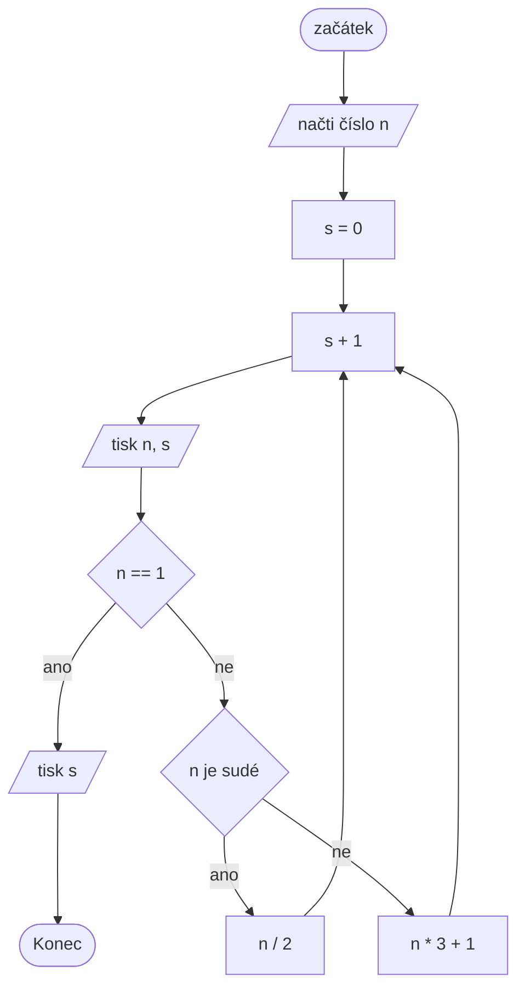

text zadaný vyučujícím
Under development 
wow uz to chapu
test chyby

```mermaid
flowchart TD
    start([začátek])
    input[/načti číslo n/]
    output[/tisk s/]
    even[n / 2]
    odd[n * 3 + 1]
    if{n je sudé}
    n{n == 1}
    init[s = 0]
    count[s + 1]
    stop([Konec])
    print[/tisk n, s/]

    start --> input
    input --> init --> count --> print --> n
    if -- ano --> even
    if -- ne --> odd
    n -- ano --> output --> stop
    n -- ne --> if
    even --> count
    odd --> count
```
diagram z přednášky
text zadaný vyučujícím  
Under development   
wow uz to chapu  
test chyby  

